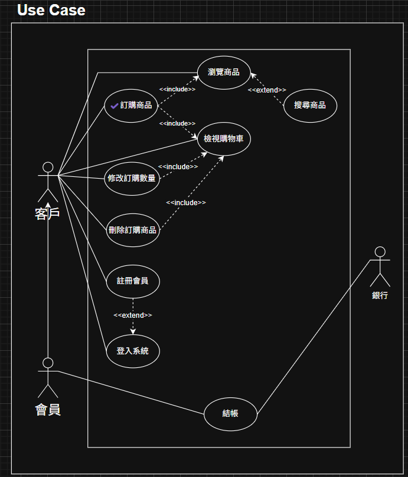
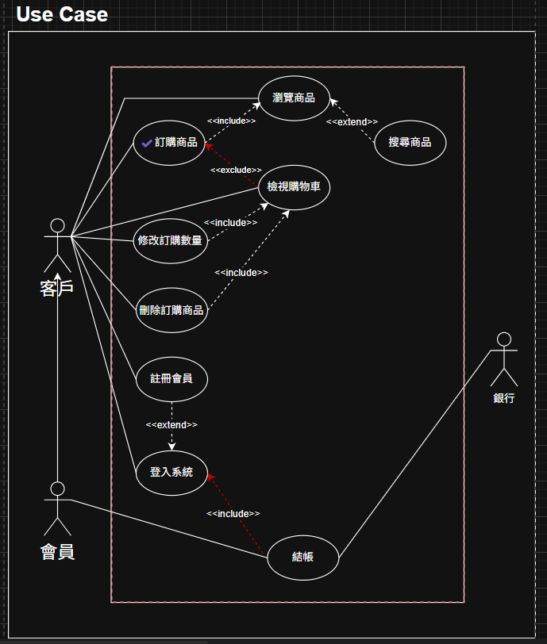
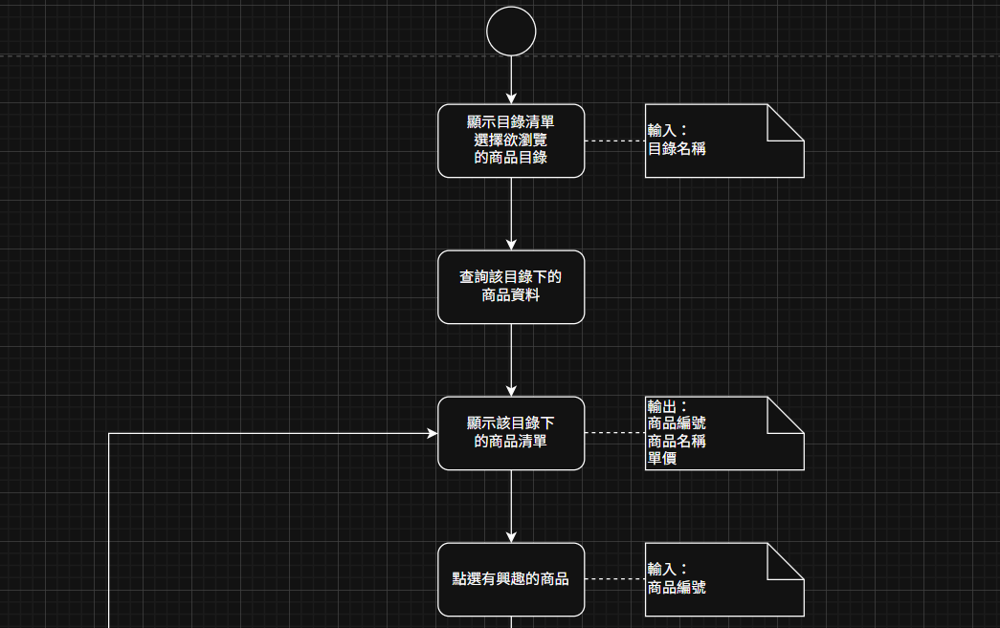
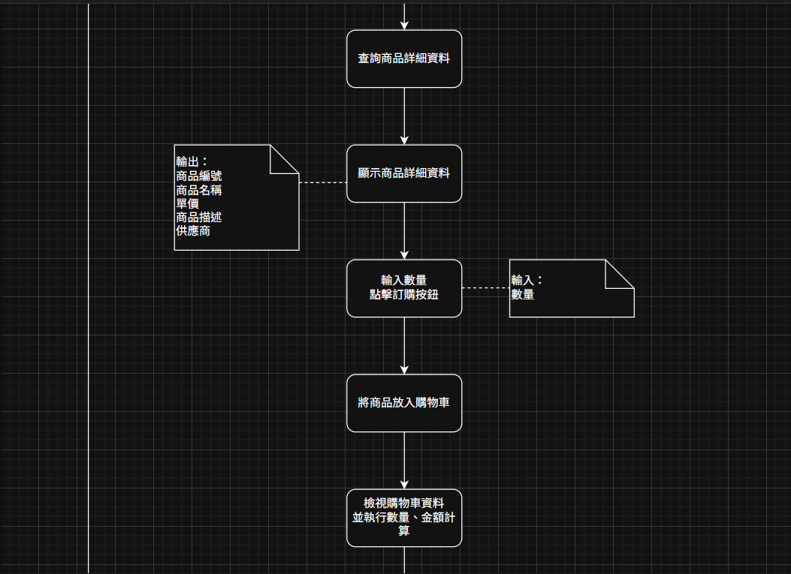
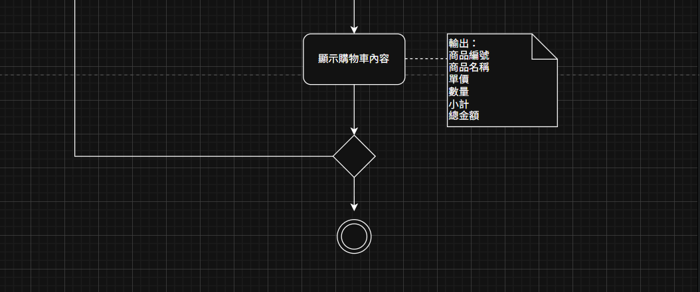
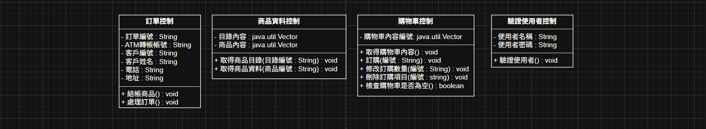
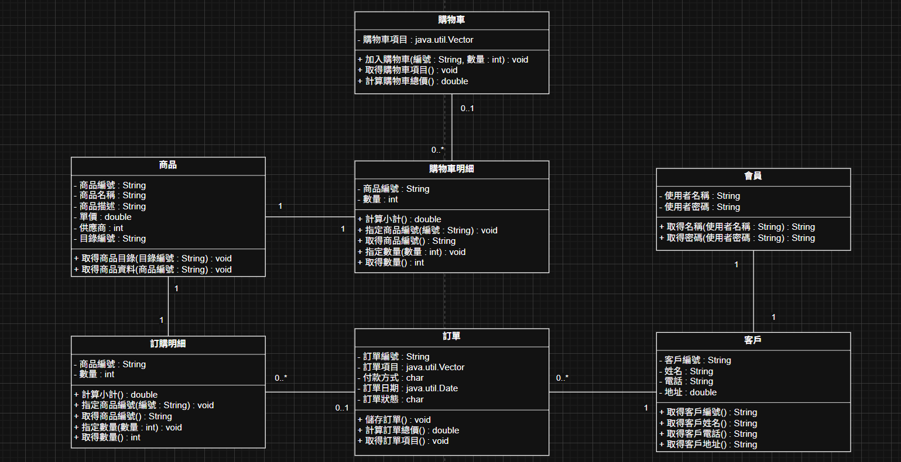
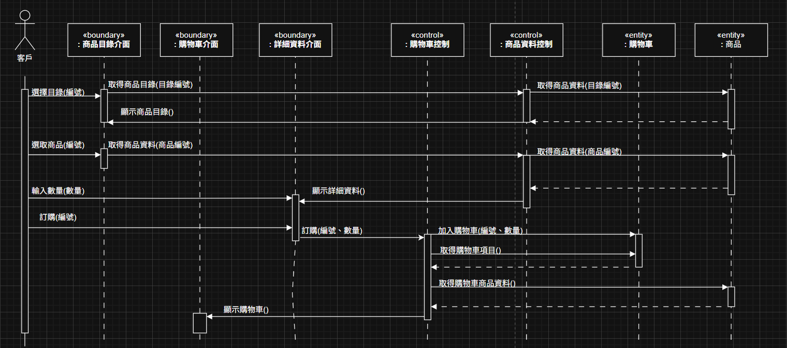
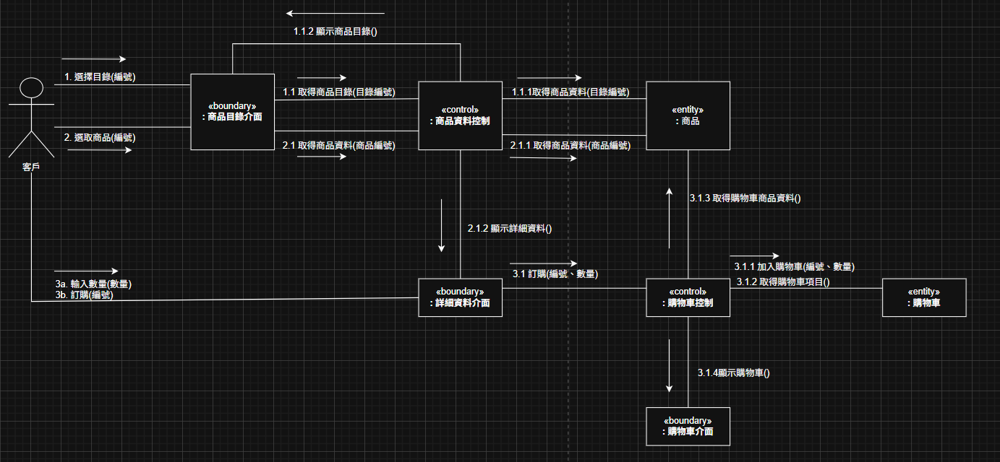

# 暑期系統分析作業範例

## 概述
參考【uml物件導向系統分析與設計】書中較完整的案例，嘗試實作老師第一次meeting提到的需求，但不一定要把這個案例當成兩個案例的其中之一，我只是想自己練習一下，順便先把後面可能遇到的坑先走過，要用其他案例也行喔 ~
+ 圖是用 draw.io 畫的 (drawioFile資料夾中有檔案，應該有APP就可以直接開)
+ 程式碼是 Java 17 (程式碼在src/main/java/)
## 選定系統主題及指定功能
+ 系統主題 : 線上購物系統
+ 指定功能 : 該系統的「訂購功能」，包含用戶瀏覽商品、選擇商品、加入購物車等流程，不包含結帳。

## Use Case Diagram (UCD)
+ 完全依照書中案例化的，沒做更改

+ 這張是把兩個我覺得怪怪的地方做一點修改後的圖(反紅標住的地方)，可以再討論看看 ~
  +  原本訂購商品後強制查看購物車(原本是include)，這邊改成不一定要查看購物車。
  +  原本結帳功能不用包含登入系統，但既然作者原本就假設結帳是屬於會員的功能，那應該要登先登入吧，不然怎知道是不是會員，所以這裡在結帳功能加上include指向系統登入。

## 使用案例規格
一樣是先照書中案例，沒做更改

| 項目    | 說明                                                                                                      |
| ----- | ------------------------------------------------------------------------------------------------------- |
| 名稱    | 訂購商品                                                                                                    |
| 摘要描述  | 客戶瀏覽商品並將訂購商品放入購物車                                                                                       |
| 主要動作者 | 客戶                                                                                                      |
| 支援動作者 | —                                                                                                       |
| 前置條件  | 客戶瀏覽商品並進入該商品詳細資料頁面                                                                                      |
| 主流程   | 1. include::瀏覽商品。 2. 客戶輸入數量、點擊訂購按鈕。 3. 系統將商品放入購物車。 4. include::檢視購物車。 5. 客戶選返回瀏覽商品，繼續訂購其他商品。 |
| 後置條件  | 將訂購商品放入購物車                                                                                              |
| 替代流程  | 2a. 客戶返回或選擇瀏覽其他商品目錄。 10a. 客戶結帳商品。                                                                    |
| 特殊需求  | 購物車內容只保留一星期      

## 活動圖
照書中案例，沒做更改

## 類別圖
+ 照書中案例，沒做更改

+ 依據實作的程式碼調整的，幾乎長得不一樣，不知道對不對，之後再討論吧~

## 循序圖
+ 照書中案例，沒做更改

## 溝通圖
這個書裡沒有現成的圖，所以參照循序圖轉成溝通圖的方法去畫，但應該高機率有問題哈哈，你們有知道怎麼改再跟我說，感謝

